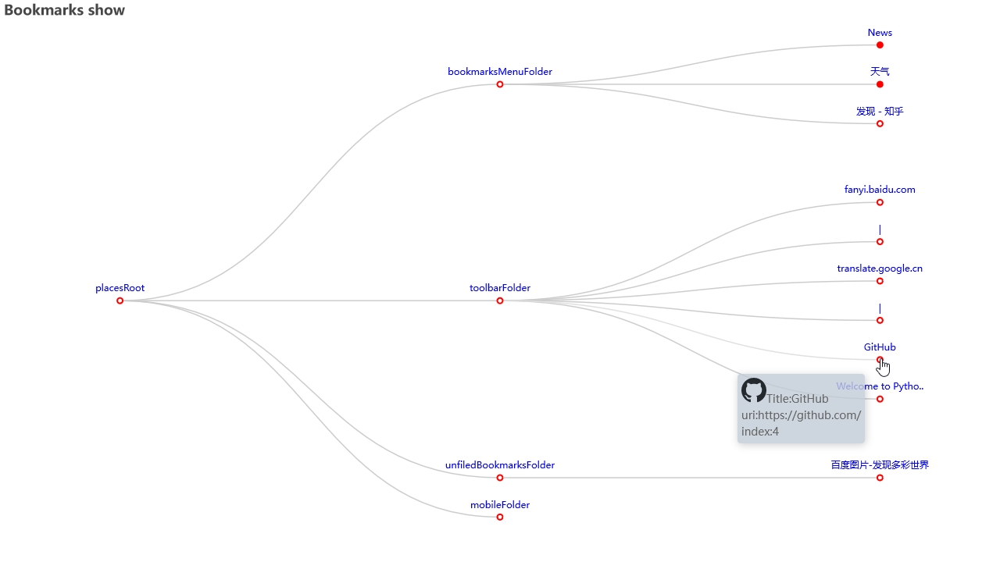
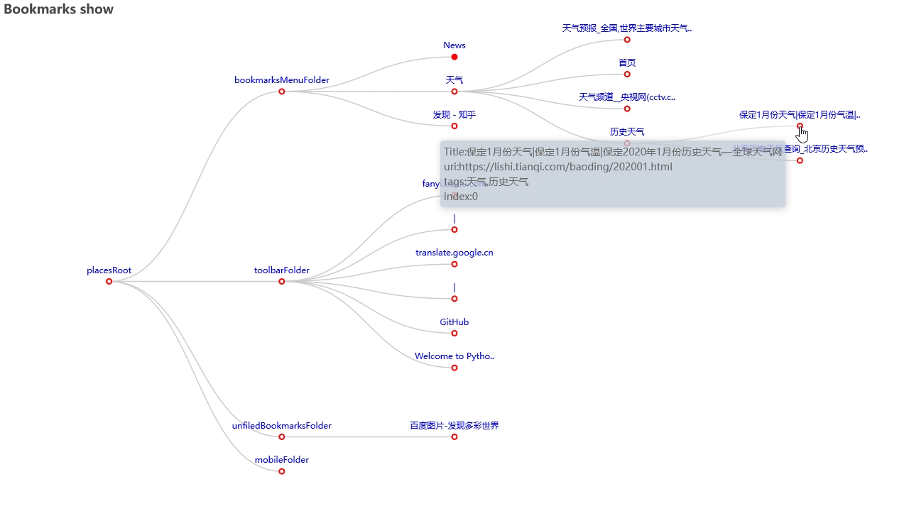

# FfBmM

## Name

FfBmM firefox bookmarks move app。

## Show

### ShowBookmark

Run **test_showbookmarks.py** in the **test** folder.
It will generate an html file in the **outdata** folder.
Open it in a browser and you will see the graphical display of the bookmarks
The effect is similar to the following screenshot

- The default number of bookmark levels is 3

- Expanding collapsed bookmarks


## Cause

There is a bookmark backup file of Firefox in JSON format, similar to "bookmarks-2022-01-21. JSON", with more than 1500 bookmarks.

Some bookmarks record different contents of the same website and are distributed in different bookmark folders.

### Bookmark structure example

Computer->c#->c# regular expression specification
Project->XXXX project->technology to be used->Application of c# regular expression
Blog->Sina Technology Blog->XXXX blog->c# the regular expression test example

## Requirement

Move all bookmarks of different contents of the same website to a bookmark folder, which has been built.

### There are two ways to move

1. Keep the original folder structure after moving.
2. After moving, they are all in one folder.

### Common needs

- Update the original folder structure as a label to the bookmark.

### Example of effect after moving

New folder
`"C# technology"`

1. Keep the original folder structure after moving.

    ```bookmark
    C# technology -> Computer -> C# -> C # regular expression specification
    C# technology -> Project -> XXXX project -> technology to be used -> Application of c# regular expression
    C# technology -> blog -> Sina Technology Blog -> XXXX blog -> C# regular expression test example
    ```

2. After moving, they are all in one folder.

    ```bookmark
    C# technology -> C# regular expression specification
    C# technology -> Application of c# regular expression
    C# technology -> C# regular expression test example
    ```

3. Common needs
    "C#'s regular expression test example", this bookmark adds 4 Tags

    ```Tags
    "C# technology" "Blog" "Sina Technology Blog" "XXXX blog"
    ```

## Background

It comes from the concept of a knowledge management platform. In metadata management, it is necessary to extract and update the metadata of browser bookmark type.

Extract and update metadata for bookmarks exported from Firefox.

One tool is to move Firefox bookmarks.

## Information

### Metadata

Metadata is the data describing data, which can be used to assist in identifying, describing and indicating the location of network electronic resources

### MS微软的meta

```html
<meta property="og:title" content="正则表达式语言 - 快速参考" /><meta property="og:type" content="website" />
<meta property="og:url" content="https://docs.microsoft.com/zh-cn/dotnet/standard/base-types/regular-expression-language-quick-reference" />
<meta property="og:description" content="此快速参考介绍了如何使用正则表达式模式匹配输入文本。 模式具有一个或多个字符文本、运算符或构造。" />
<meta property="og:image" content="https://docs.microsoft.com/dotnet/media/dot-net-cross-platform.png" />
<meta property="og:image:alt" content="正则表达式语言 - 快速参考 | Microsoft Docs" />
<meta name="twitter:card" content="summary" />
<meta name="twitter:site" content="@docsmsft" />
<meta name="color-scheme" content="light dark">
<meta name="apiPlatform" content="dotnet" />
<meta name="author" content="adegeo" />
<meta name="bilingual_type" content="hover over" />
<meta name="breadcrumb_path" content="/dotnet/breadcrumb/toc.json" />
<meta name="depot_name" content="VS.core-docs" />
<meta name="description" content="此快速参考介绍了如何使用正则表达式模式匹配输入文本。 模式具有一个或多个字符文本、运算符或构造。" />
<meta name="document_id" content="16d4698e-4220-c422-a554-8a481803d240" />
<meta name="document_version_independent_id" content="f0e3b82a-8d81-ad9e-97fc-efb92f7d0d38" />
<meta name="gitcommit" content="https://github.com/dotnet/docs.zh-cn/blob/df24caa7c06680f7f6e6bd5a4a8332e615e9b3ea/docs/standard/base-types/regular-expression-language-quick-reference.md" />
<meta name="locale" content="zh-cn" />
<meta name="ms.assetid" content="930653a6-95d2-4697-9d5a-52d11bb6fd4c" />
<meta name="ms.author" content="adegeo" />
<meta name="ms.contentlocale" content="zh-CN" />
<meta name="ms.date" content="03/30/2017" />
<meta name="ms.devlang" content="dotnet" />
<meta name="ms.lasthandoff" content="11/18/2020" />
<meta name="ms.locfileid" content="94818799" />
<meta name="ms.openlocfilehash" content="1b261211997837e8664ea60e9210a7f0517f7a9f" />
<meta name="ms.prod" content="dotnet-fundamentals" />
<meta name="ms.sourcegitcommit" content="965a5af7918acb0a3fd3baf342e15d511ef75188" />
<meta name="ms.topic" content="how-to" />
<meta name="ms.translationtype" content="HT" />
<meta name="original_content_git_url" content="https://github.com/dotnet/docs.zh-cn/blob/live/docs/standard/base-types/regular-expression-language-quick-reference.md" />
<meta name="page_type" content="conceptual" />
<meta name="pdf_url_template" content="https://docs.microsoft.com/pdfstore/zh-cn/VS.core-docs/{branchName}{pdfName}" />
<meta name="recommendations" content="true" />
<meta name="schema" content="Conceptual" />
<meta name="search.mshattr.devlang" content="csharp" />
<meta name="show_latex" content="true" />
<meta name="site_name" content="Docs" />
<meta name="toc_rel" content="../../fundamentals/toc.json" />
<meta name="uhfHeaderId" content="MSDocsHeader-DotNet" />
<meta name="updated_at" content="2021-09-15 11:11 AM" />
<meta name="word_count" content="3526" />
```

### intel的meta

```html
<meta name="X-Server" content=INTE-T1/>
<meta http-equiv="X-UA-Compatible" content="IE=Edge"/>
<meta http-equiv="x-dns-prefetch-control" content="on"/>
<!--[if lte IE 9]>
<meta http-equiv="X-UA-Compatible" content="IE=9"/>
<![endif]-->
<meta name="apple-itunes-app" content="app-id=587995732"/>
<meta name="twitter:app:id:googleplay" content="com.intel.ark"/>
<meta name="twitter:card" content="summary"/>
<meta name="twitter:app:id:ipad" content="id587995732"/>
<meta name="description" content="英特尔® 产品规格、特性和兼容性快速参考指南和代码名称解码器。比较产品，包括处理器、台式机主板、服务器产品和网络产品。"/>
<meta name="language" content="zh"/>
<meta name="twitter:app:name:googleplay" content="Intel® ARK (Product Specs)"/>
<meta name="twitter:app:id:iphone" content="id587995732"/>
<meta name="twitter:creator" content="@IntelSupport"/>
<meta name="twitter:site" content="@IntelSupport"/>
<meta name="twitter:app:name:ipad" content="Intel® ARK (Product Specs)"/>
<meta name="google-play-app" content="app-id=com.intel.ark"/>
<meta name="twitter:app:name:iphone" content="Intel® ARK (Product Specs)"/>
<meta property="og:image" content="http://ark.intel.com/inc/images/fusionmobile/intel-logo-blue.png"/>
<meta property="og:type" content="article"/>
<meta property="og:sitename" content="Intel® ARK (Product Specs)"/>
<meta property="og:title" content="英特尔产品规格"/>
<meta property="og:url" content="https://www.intel.cn/content/www/cn/zh/ark.html"/>
<meta property="og:description" content="英特尔® 产品规格、特性和兼容性快速参考指南和代码名称解码器。比较产品，包括处理器、台式机主板、服务器产品和网络产品。"/>

<meta name="viewport" content="width=device-width, initial-scale=1.0, user-scalable=yes">

```

### 人民网pepole

```html
<meta name="renderer" content="webkit" />
<meta http-equiv="X-UA-Compatible" content="IE=Edge" />
<meta name="viewport" content="width=device-width,initial-scale=1.0,minimum-scale=1.0,maximum-scale=1.0" />
<meta name="keywords" content="" />
<meta name="description" content="发展政府性融资担保，是促进实体经济发展的重要逆周期调节工具。在近日举行的全国财政工作视频会议上，财政部提出2022年将继续实行小微企业融资担保降费奖补。政府性融资担保体系如何自上而下撬动更多担保资金去" />
<meta name="copyright" content="人民网版权所有" />
<meta name="filetype" content="0">
<meta name="publishedtype" content="1">
<meta name="pagetype" content="1">
<meta name="catalogs" content="1004">
<meta name="contentid" content="32337124">
<meta name="publishdate" content="2022-01-22">
<meta name="author" content="1464">
<meta name="editor" content="">
<meta name="source" content="来源：人民日报">
<meta name="sourcetype" content="">
```

### google

```html
<meta name="viewport" content="width=device-width,initial-scale=1,minimum-scale=1.0" />
<meta name="google" content="notranslate" />
<meta name="format-detection" content="telephone=no" />
<meta name="google-site-verification" content="sp-RFHUl69ePlsCUjwgzU3Y0H0P5dxzzaszJOtwaDNQ" />
<meta name="mobile-web-app-capable" content="yes" />
<meta name="apple-mobile-web-app-capable" content="yes" />
<meta name="application-name" content="Google Translate" />
<meta name="apple-mobile-web-app-title" content="Google Translate" />
<meta name="theme-color" content="#4285F4" />
<meta name="msapplication-tap-highlight" content="no" />
```

### baidu百度

```html
<meta http-equiv="Content-Type" content="text/html;charset=utf-8" />
<meta http-equiv="X-UA-Compatible" content="IE=edge,chrome=1" />
<meta content="always" name="referrer" />
<meta name="theme-color" content="#ffffff" />
<meta name="description" content="全球领先的中文搜索引擎、致力于让网民更便捷地获取信息，找到所求。百度超过千亿的中文网页数据库，可以瞬间找到相关的搜索结果。" />
```
