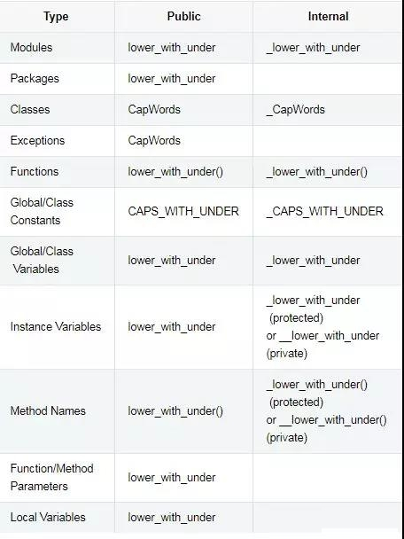

# Python之父Guido推荐的规范

## Modules

* Public：lower_with_under
* Internal： _lower_with_under
  
## ddd

* pubic:
* Internal：

## Packages

* pubic:
* Internal： lower_with_under

---

---

| Type                       | Public             | Internal                                                        |
| -------------------------- | ------------------ | --------------------------------------------------------------- |
| Modules                    | lower_with_under   | _lower_with_under                                               |
| Packages                   | lower_with_under   |                                                                 |
| Classes                    | CapWords           | _CapWords                                                       |
| Exceptions                 | CapWords           | _CapWords                                                       |
| Functions                  | lower_with_under() | _lower_with_under()                                             |
| Global/Class Constants     | CAPS_WITH_UNDER    | _CAPS_WITH_UNDER                                                |
| Global/Class Variables     | lower_with_under   | _lower_with_under                                               |
| Instance Variables         | lower_with_under   | _lower_with_under (protected) or __lower_with_under() (private) |
| Method Names               | lower_with_under() | _lower_with_under (protected) or __lower_with_under() (private) |
| Function/Method Parameters | lower_with_under   |                                                                 |
| Local Variables            | lower_with_under   |                                                                 |
